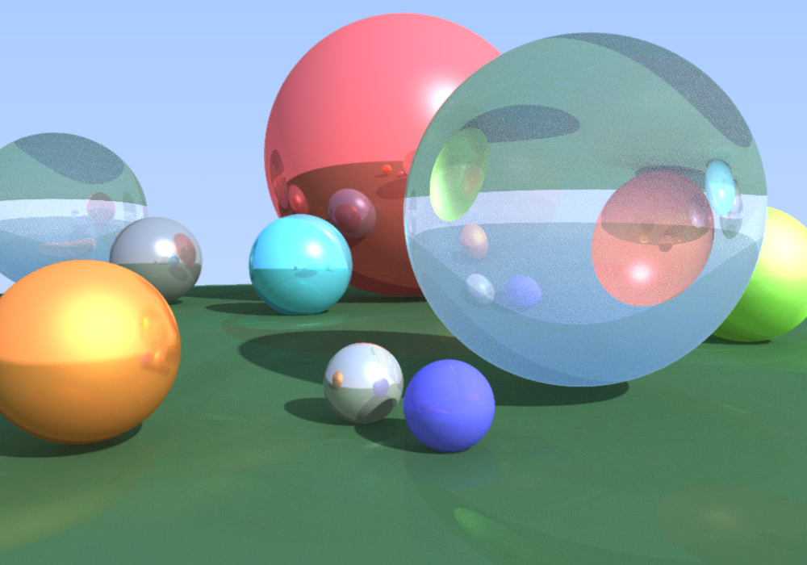

# WebGL-Raytracer
A  ray-tracer based on WebGL

Live Demo Available at [https://nemo1999.github.io/](https://nemo1999.github.io/)

It is inspired by 
- [https://raytracing.github.io/books/RayTracingInOneWeekend.html](https://raytracing.github.io/books/RayTracingInOneWeekend.html)
- [https://github.com/evanw/webgl-path-tracing](https://github.com/evanw/webgl-path-tracing)
